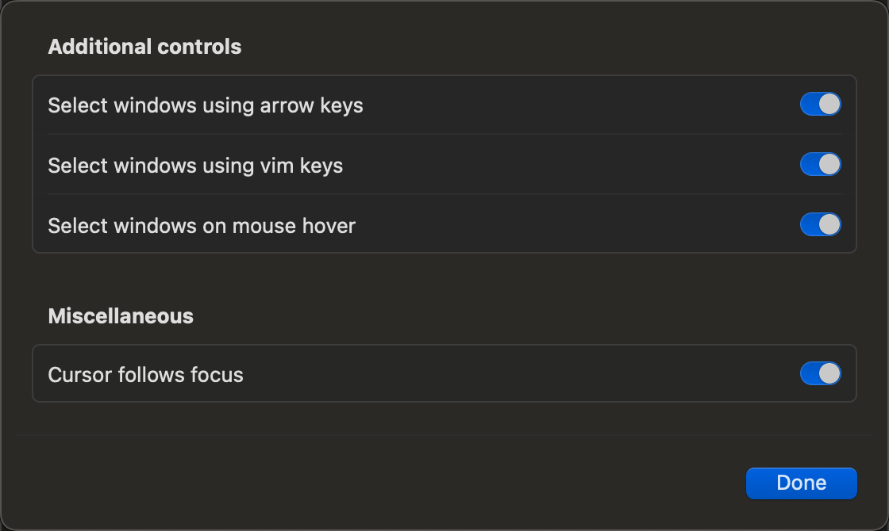

# Personal macOS&Linux configuration

## Nix flake usage scenarios

* macOS: [home-manager](https://github.com/nix-community/home-manager) only (I don't employ nix-darwin).
* Linux: NixOS with embeded home-manager.
* linux distribution like ubuntu: home-manager only.

## Routine maintenance operations

* Update sops keys: `make update-sops`
* Edit encrypted information(files, ..): `make edit-backup`
* Make global flake registry consistent with this flake repo: `make pin-registry`


## Initliazation

Clone this directory and place it in the home directory (for neovim and chezmoi).


### home-manager(macOS)

Firstly, put the following content in the file `/etc/nix/nix.conf`:

```
build-users-group = nixbld
experimental-features = nix-command flakes
trusted-users = root penglei
```


Then, do initialize:

```
❯ nix --extra-experimental-features nix-command --extra-experimental-features flakes run nixpkgs#home-manager switch -- --flake .#penglei.aarch64-darwin
```

#### Replace zsh's nix env injection

In a flake directory, we can employ [direnv](https://github.com/direnv/direnv) to automatically initialize the shell using `use flake`.
However, subsequently adding packages temporarily by `nix shell ...` does not take effect in this shell.
The reason is that the path priority in its PATH variable is incorrect, and the fundamental cause is that
subshells reinitialize by reading configurations (such as zshrc) are not reentrant.
The following configuration can solve this problem:

```
XDG_DATA_DIRS=${XDG_DATA_DIRS:-/usr/local/share:/usr/share}
export NIX_PROFILES="/nix/var/nix/profiles/default $HOME/.nix-profile"
setopt local_options shwordsplit
for i in $NIX_PROFILES; do
  if [ -e "$i/etc/ssl/certs/ca-bundle.crt" ]; then
    export NIX_SSL_CERT_FILE=$i/etc/ssl/certs/ca-bundle.crt
  fi

  #if ! (($path[(I)$i/bin])); #zsh style
  if [ -e "$i/bin" ]; then
    if ! [[ :$PATH: == *:"$i/bin":* ]]; then
      export PATH="$i/bin:$PATH"
    fi
  fi
  if [ -e "$i/share" ]; then
    if ! [[ :$XDG_DATA_DIRS == *:"$i/share"* ]]; then
      export XDG_DATA_DIRS="$XDG_DATA_DIRS:$i/share"
    fi
  fi
done
unset i
```

#### config sudo

Add the following content to `/etc/sudoers.d/user`

```
penglei ALL=(root) NOPASSWD: /usr/bin/su -
```

_pam\_smartcard module has enabled by default, we needn't do anything more._

#### twm

1. Disable most default keyboard shortcuts.

    *Launchpad & Dock*, *Mission Control*, *Keyboard*, *Services*, **Spotlight**, 

    In **Mission Control**, modify keyboard shortcuts like this:
    1. `Option + Up`: Mission Control
    2. `Option + Down`: Application window

2. **Modifer Keys**: Caps Lock -> Control

3. **Disable "Automatically rearrange Spaces based on most recent use"** in `Desktop & Dock > Mission Control`


#### more initialization actions should be done mannually

1. restore passage and gpg keys: `make restore`

    After placing the private key in the directory `~/.gnupg/private-keys-v1.d` , manually restart the agent:

    ```
    ❯ gpgconf --kill gpg-agent
    ❯ gpgconf --launch gpg-agent
    ```

1. copy zsh command history

#### alt-tab

To quit app followed by mouse cursor, recommend enabling all additional control configurations:

<p align="center">

</p>

### Linux(NixOS)

```
$ sudo nixos-rebuild switch --flake .
```

## Tips

* rollback nixos

    ```
    /nix/var/nix/profiles/system-*-link/bin/switch-to-configuration switch
    ```

* Clean home-manager news

    ```
    home-manager news --flake .
    ```

* Using vim on a freshly installed Linux (NixOS)

    Why: The newly installed NixOS does not come with vim by default(but carrying nano..),
    Use the following command to temporarily use vim:

    ```
    $ nix --extra-experimental-features nix-command --extra-experimental-features flakes shell nixpkgs#vim
    ```

* Clean journald logs one hour ago

  ```
  # journalctl --rotate
  # journalctl --vacuum-time=1h
  ```

### macOS ops

* yabai

    * Installing yabai

        1. Switching between spaces requires disabling sip.

            ```
            csrutil enable --without fs --without debug --without nvram
            ```

        1. configure sudo

            Append the following content to `/etc/sudoers.d/user`

            ```
            penglei ALL=(root) NOPASSWD: /Users/penglei/.nix-profile/bin/yabai --load-sa
            penglei ALL=(root) NOPASSWD: /Users/penglei/.nix-profile/bin/yabai --uninstall-sa
            ```

            After completing the sudo configuration, we can manually run `sudo yabai --load-sa`` once without waiting for the next reboot.


    * restart yabai daemon

        ```
        # launchctl load -F ~/Library/LaunchAgents/org.nix-community.home.yabai.plist
        # launchctl unload -F ~/Library/LaunchAgents/org.nix-community.home.yabai.plist
        # launchctl kickstart -k gui/$(id -u)/org.nix-community.home.yabai
        ```


* rime/squirrel

    log location:

    * $TMPDIR/rime.squirrel/Squirrel.INFO
    * $TMPDIR/rime.squirrel/Squirrel.WARNING

    **Force deployment after updating configuration**

    1. Run *home-manager switch* to link rime configuration again
    1. Clean cache

       ```
       rm -rf ~/Library/Rime/build
       ```
    1. Do squirrel Deploy (click in menu)


    *installation.yaml should be writable after upgrading squirrel.*


* upgrade nix

  run in root:
  ```
  # nix profile install nixpkgs#nix_git
  ```

## references

* shell expansion

    * https://www.gnu.org/software/bash/manual/html_node/Shell-Parameter-Expansion.html
    * https://zsh.sourceforge.io/Doc/Release/Expansion.html
    * https://zsh.sourceforge.io/Doc/Release/Expansion.html#Modifiers
    * https://zsh.sourceforge.io/Doc/Release/Expansion.html#Parameter-Expansion
    * https://stackoverflow.com/questions/3435355/remove-entry-from-array
    * https://unix.stackexchange.com/questions/411304/how-do-i-check-whether-a-zsh-array-contains-a-given-value

* macOS

    * [NSUserDefaults](https://juejin.cn/post/6844903464300969991)
    * [Awesome macOS apps](https://github.com/icopy-site/awesome-cn/blob/master/docs/awesome/open-source-mac-os-apps.md)


    * Rime Input Method

        * [rime-ice framework](https://github.com/iDvel/rime-ice)
        * [Grammer model](https://github.com/lotem/rime-octagram-data/tree/hans)
        * [*Shift+space* as switcher key](https://github.com/rime/squirrel/issues/113)

    * Font

        * [LaTeX "Kaiti SC" cannot be found](https://jia.je/software/2021/02/09/big-sur-m1-latex-kaiti-fonts/)
        * [Linux fontconfig matching mechanism](https://catcat.cc/post/2020-10-31/)
        * [nerd icon font](https://www.nerdfonts.com/cheat-sheet)


## TODOs

* [ ] Inject username while employ home-manager alone.
