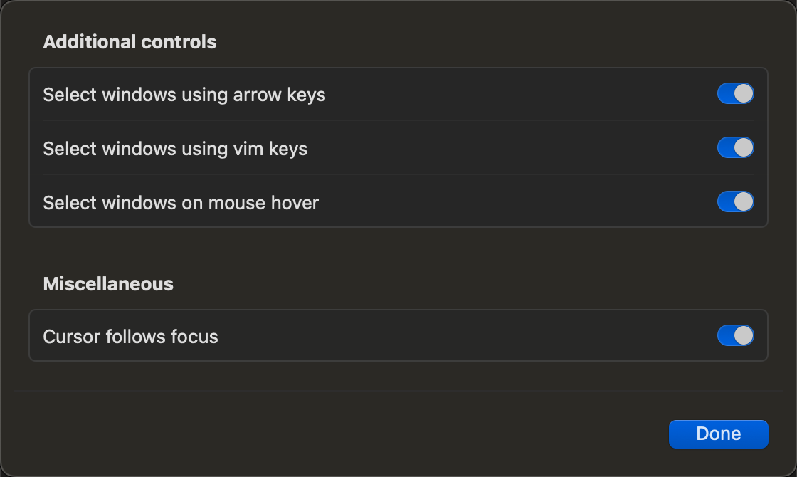

# Personal macOS & Linux Configuration

## Table of Contents

- [Nix Flake Usage Scenarios](#nix-flake-usage-scenarios)
- [Routine Maintenance Operations](#routine-maintenance-operations)
- [Initialization](#initialization)
  - [home-manager (macOS)](#home-manager-macos)
  - [Linux (NixOS)](#linux-nixos)
- [Tips](#tips)
  - [General](#general)
  - [macOS Operations](#macos-operations)
- [References](#references)
- [TODOs](#todos)

## Nix Flake Usage Scenarios

- **macOS**: [home-manager](https://github.com/nix-community/home-manager) only (I don't use nix-darwin).
- **Linux (NixOS)**: NixOS with embedded home-manager.
- **Linux (non-NixOS)**: home-manager only (e.g., Ubuntu).

## Routine Maintenance Operations

- Update sops keys: `make update-sops`
- Edit encrypted files: `make edit-backup`
- Pin global flake registry to this repo: `make pin-registry`

## Initialization

Clone this repository and place it in the home directory (required by neovim and chezmoi).

### home-manager (macOS)

First, add the following to `/etc/nix/nix.conf`:

```ini
build-users-group = nixbld
experimental-features = nix-command flakes
trusted-users = root penglei
```

Then initialize home-manager:

```bash
$ nix --extra-experimental-features nix-command --extra-experimental-features flakes run nixpkgs#home-manager switch -- --flake .#penglei.aarch64-darwin
```

#### Replace zsh's nix env injection

In a flake directory, [direnv](https://github.com/direnv/direnv) can initialize the shell via `use flake` automatically.
However, subsequently adding packages with `nix shell ...` does not take effect in this shell.
The root cause is incorrect PATH priority: subshells that reinitialize by re-reading configurations (e.g., zshrc) are not reentrant.
The following configuration solves this problem:

```zsh
XDG_DATA_DIRS=${XDG_DATA_DIRS:-/usr/local/share:/usr/share}
export NIX_PROFILES="/nix/var/nix/profiles/default $HOME/.nix-profile"

setopt local_options shwordsplit
export NIX_SSL_CERT_FILE=/etc/ssl/cert.pem
for i in $NIX_PROFILES; do
  if [ ! -e "$NIX_SSL_CERT_FILE" ]; then
    if [ -e "$i/etc/ssl/certs/ca-bundle.crt" ]; then
      export NIX_SSL_CERT_FILE=$i/etc/ssl/certs/ca-bundle.crt
    fi
  fi

  if [ -e "$i/bin" ]; then
    if ! [[ :$PATH: == *:"$i/bin":* ]]; then
      export PATH="$i/bin:$PATH"
    fi
  fi
  if [ -e "$i/share" ]; then
    if ! [[ :$XDG_DATA_DIRS == *:"$i/share"* ]]; then
      export XDG_DATA_DIRS="$XDG_DATA_DIRS:$i/share"
    fi
  fi
done
unset i
```

The nix installer initializes the shell env with:

```bash
# Nix
if [ -e '/nix/var/nix/profiles/default/etc/profile.d/nix-daemon.sh' ]; then
 . '/nix/var/nix/profiles/default/etc/profile.d/nix-daemon.sh'
fi
# End Nix
```

If SSL is broken (e.g., after `nix profile remove cacert`), set the env explicitly:

```bash
if [ -e '/nix/var/nix/profiles/default/etc/profile.d/nix-daemon.sh' ]; then
 . '/nix/var/nix/profiles/default/etc/profile.d/nix-daemon.sh'
fi
if [ ! -e "$NIX_SSL_CERT_FILE" ]; then
  export NIX_SSL_CERT_FILE=/etc/ssl/cert.pem
fi
```

#### Configure sudo

Add the following to `/etc/sudoers.d/user`:

```sudoers
penglei ALL=(root) NOPASSWD: /usr/bin/su -
```

_pam\_smartcard module is enabled by default; no additional configuration needed._

#### Window Manager (twm)

1. Disable most default keyboard shortcuts:

    *Launchpad & Dock*, *Mission Control*, *Keyboard*, *Services*, **Spotlight**

    In **Mission Control**, modify keyboard shortcuts:
    - `Option + Up`: Mission Control
    - `Option + Down`: Application Windows

2. **Modifier Keys**: Caps Lock -> Control

3. **Disable "Automatically rearrange Spaces based on most recent use"** in `Desktop & Dock > Mission Control`

#### Additional manual initialization steps

1. Restore passphrase and GPG keys: `make restore`

    After placing the private key in `~/.gnupg/private-keys-v1.d`, restart the agent:

    ```bash
    $ gpgconf --kill gpg-agent
    $ gpgconf --launch gpg-agent
    ```

2. Copy zsh command history

#### alt-tab

To quit app followed by mouse cursor, enable all additional control configurations:

<p align="center">

</p>

### Linux (NixOS)

```bash
$ sudo nixos-rebuild switch --flake .
```

## Tips

### General

- **Rollback NixOS**

    ```bash
    # /nix/var/nix/profiles/system-*-link/bin/switch-to-configuration switch
    ```

- **Clean home-manager news**

    ```bash
    $ home-manager news --flake .
    ```

- **Use vim on a freshly installed NixOS**

    NixOS does not include vim by default (only nano). Use the following to get vim temporarily:

    ```bash
    $ nix --extra-experimental-features nix-command --extra-experimental-features flakes shell nixpkgs#vim
    ```

- **Clean journald logs older than one hour**

    ```bash
    # journalctl --rotate
    # journalctl --vacuum-time=1h
    ```

### macOS Operations

#### yabai

- **Installing yabai**

    1. Switching between spaces requires disabling SIP:

        ```bash
        $ csrutil enable --without fs --without debug --without nvram
        ```

    2. Configure sudo — append to `/etc/sudoers.d/user`:

        ```sudoers
        penglei ALL=(root) NOPASSWD: /Users/penglei/.nix-profile/bin/yabai --load-sa
        penglei ALL=(root) NOPASSWD: /Users/penglei/.nix-profile/bin/yabai --uninstall-sa
        ```

        After completing the sudo configuration, manually run `sudo yabai --load-sa` once without waiting for the next reboot.

- **Restart yabai daemon**

    ```bash
    $ launchctl load -F ~/Library/LaunchAgents/org.nix-community.home.yabai.plist
    $ launchctl unload -F ~/Library/LaunchAgents/org.nix-community.home.yabai.plist
    $ launchctl kickstart -k gui/$(id -u)/org.nix-community.home.yabai
    ```

#### rime/squirrel

Log locations:

- `$TMPDIR/rime.squirrel/Squirrel.INFO`
- `$TMPDIR/rime.squirrel/Squirrel.WARNING`

**Force deployment after updating configuration:**

1. Run `home-manager switch` to re-link rime configuration
2. Clean cache:

    ```bash
    $ rm -rf ~/Library/Rime/build
    ```

3. Click "Deploy" in the Squirrel menu

_`installation.yaml` should be writable after upgrading Squirrel._

#### Upgrade nix

Run as root:

```bash
# nix profile install nixpkgs#nix_git
```

## References

- **Shell Expansion**

    - [Bash Parameter Expansion](https://www.gnu.org/software/bash/manual/html_node/Shell-Parameter-Expansion.html)
    - [Zsh Expansion](https://zsh.sourceforge.io/Doc/Release/Expansion.html)
    - [Zsh Modifiers](https://zsh.sourceforge.io/Doc/Release/Expansion.html#Modifiers)
    - [Zsh Parameter Expansion](https://zsh.sourceforge.io/Doc/Release/Expansion.html#Parameter-Expansion)
    - [Remove entry from array](https://stackoverflow.com/questions/3435355/remove-entry-from-array)
    - [Check if zsh array contains value](https://unix.stackexchange.com/questions/411304/how-do-i-check-whether-a-zsh-array-contains-a-given-value)

- **macOS**

    - [NSUserDefaults](https://juejin.cn/post/6844903464300969991)
    - [Awesome macOS apps](https://github.com/icopy-site/awesome-cn/blob/master/docs/awesome/open-source-mac-os-apps.md)

- **Rime Input Method**

    - [rime-ice framework](https://github.com/iDvel/rime-ice)
    - [Grammar model](https://github.com/lotem/rime-octagram-data/tree/hans)
    - [*Shift+Space* as switcher key](https://github.com/rime/squirrel/issues/113)

- **Font**

    - [LaTeX "Kaiti SC" cannot be found](https://jia.je/software/2021/02/09/big-sur-m1-latex-kaiti-fonts/)
    - [Linux fontconfig matching mechanism](https://catcat.cc/post/2020-10-31/)
    - [Nerd icon font cheat sheet](https://www.nerdfonts.com/cheat-sheet)

## TODOs

- [ ] Inject username when using home-manager standalone.
